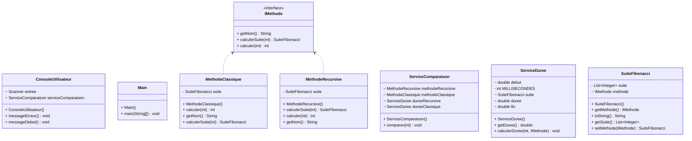

## Voici le diagramme de tp2_rapport_de_revue (SuiteFibonacci) :

```mermaid
classDiagram
direction BT
class ConsoleUtilisateur {
  + ConsoleUtilisateur() 
  ~ Scanner entree
  ~ ServiceComparaison serviceComparaison
  + messageErreur() void
  + messageDebut() void
}
class IMethode {
<<Interface>>
  + getNom() String
  + calculerSuite(int) SuiteFibonacci
  + calculer(int) int
}
class Main {
  + Main() 
  + main(String[]) void
}
class MethodeClassique {
  + MethodeClassique() 
  - SuiteFibonacci suite
  + calculer(int) int
  + getNom() String
  + calculerSuite(int) SuiteFibonacci
}
class MethodeRecursive {
  + MethodeRecursive() 
  - SuiteFibonacci suite
  + calculerSuite(int) SuiteFibonacci
  + calculer(int) int
  + getNom() String
}
class ServiceComparaison {
  + ServiceComparaison() 
  ~ MethodeRecursive methodeRecursive
  ~ MethodeClassique methodeClassique
  ~ ServiceDuree dureeRecursive
  ~ ServiceDuree dureeClassique
  + comparer(int) void
}
class ServiceDuree {
  + ServiceDuree() 
  ~ double debut
  - int MILLISECONDES
  ~ SuiteFibonacci suite
  ~ double duree
  ~ double fin
  + getDuree() double
  + calculerDuree(int, IMethode) void
}
class SuiteFibonacci {
  + SuiteFibonacci() 
  - List~Integer~ suite
  ~ IMethode methode
  + getMethode() IMethode
  + toString() String
  + getSuite() List~Integer~
  + setMethode(IMethode) SuiteFibonacci
}

MethodeClassique  ..>  IMethode 
MethodeRecursive  ..>  IMethode 

```